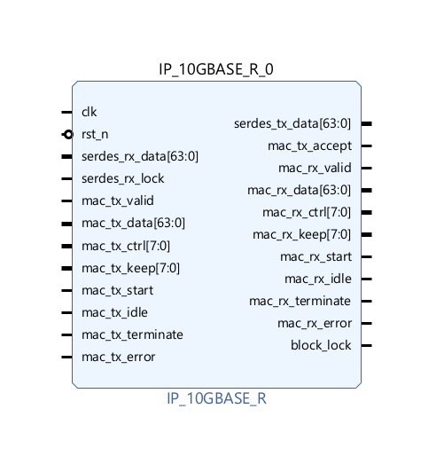

# S26 Wrap-Up

We have a packaged PCS IP under `FPGA/PCS_IP`. To add it to your project run the following script:



```tcl
cd {your local path to the repo}
source scripts/add_pcs_ip.tcl
```

A random dummy project with a temporary top wrapper is also provided (you can't set the IP as top by itself as its number of IOs exceeds the count on FPGA):

```tcl
cd {your local path to the repo}
source scripts/build_pcs_tmp_wrapper.tcl
```

Disclaimer: future updates possible based on precise SerDes configuration and any architectural complexity/need that later arise.

Up-to-date revised documentation can be found on the Notion page.